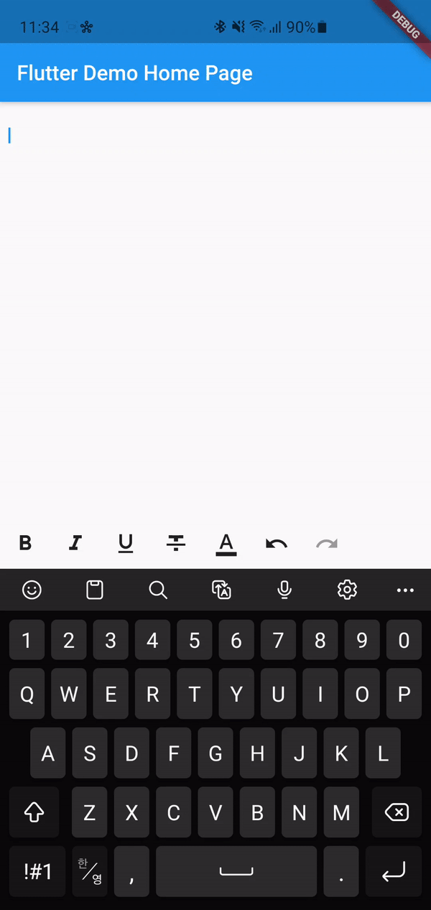

<h1 align="center">flutter_rich_text_editor</h1>

<p align="center">
  
</p>

<p align="center">
Rich text editor for flutter
</p>

## Preview

<p align="center">
    
</p>

## Requirements

Must be use flutter **v1.8.3** or later, Dart 2.2.2 or later

## Getting Started

* Add this lines to pubspec.yaml

```yaml
rich_text_editor:
  git:
    url: https://github.com/namhyun-gu/flutter_rich_text_editor
```

## Using

* Import library 

```dart
import 'package:rich_text_editor/rich_text_editor.dart';
```

* Initialize controller

> SpannableTextEditingController is extends TextEditingController. Therefore you can use TextEditingController interfaces.

```dart
SpannableTextEditingController controller = SpannableTextEditingController();

// Initialize with saved text (No style applied)
SpannableTextEditingController controller = SpannableTextEditingController(
  text: "Hello",
);

// Initialize with saved text and style
String savedStyleJson;

SpannableList styleList = SpannableList.fromJson(savedStyleJson); 
SpannableTextEditingController controller = SpannableTextEditingController(
  text: "Hello",
  styleList: styleList
);

// or

SpannableTextEditingController controller = SpannableTextEditingController.fromJson(
  text: "Hello",
  styleJson: savedStyleJson
);
```

* Add controller to TextField

```dart
TextField(
  controller: controller,
  keyboardType: TextInputType.multiline,
  maxLines: null,
  decoration: InputDecoration(
    border: InputBorder.none,
    focusedBorder: InputBorder.none,
    filled: false,
  ),
)
```

* Control selection style

```dart
// Set selection style
controller.setSelectionStyle((currentStyle) {
  var newStyle = currentStyle;
  // Set bold
  newStyle.setStyle(styleBold);
  return newStyle;
});

// Get selection style
SpannbleStyle style = controller.getSelectionStyle();
```

* Control composing style

```dart
var newStyle = controller.composingStyle;
// Set bold
newStyle.setStyle(styleBold);
controller.composingStyle = newStyle;
```

> Can use predefined StyleToolbar widget

```dart
StyleToolbar(
  controller: controller,
),
```

* Undo & Redo operation

```dart
// Undo
controller.canUndo();
controller.undo();

// Redo
controller.canRedo();
controller.redo();
```

* Save style list

> Currently not support standard rich text format. can use json type list only.

```dart
controller.styleList.toJson();
```

* Use style list to RichText widget

```dart
String text;
SpannableList list;
TextStyle defaultStyle;

RichText(
  text: list.toTextSpan(text, defaultStyle: defaultStyle),
);
```

* Use SpannableStyle

```dart
// Font styles
var style = SpannableStyle();

style.setStyle(styleBold);
style.hasStyle(styleBold); // true
style.clearStyle(styleBold);
style.hasStyle(styleBold); // false

// Text foreground color
Color color = Colors.red;

style.setForegroundColor(color);
style.clearForegroundColor();
```

## License

```
Copyright 2019 Namhyun, Gu

Licensed under the Apache License, Version 2.0 (the "License");
you may not use this file except in compliance with the License.
You may obtain a copy of the License at

   http://www.apache.org/licenses/LICENSE-2.0

Unless required by applicable law or agreed to in writing, software
distributed under the License is distributed on an "AS IS" BASIS,
WITHOUT WARRANTIES OR CONDITIONS OF ANY KIND, either express or implied.
See the License for the specific language governing permissions and
limitations under the License.
```